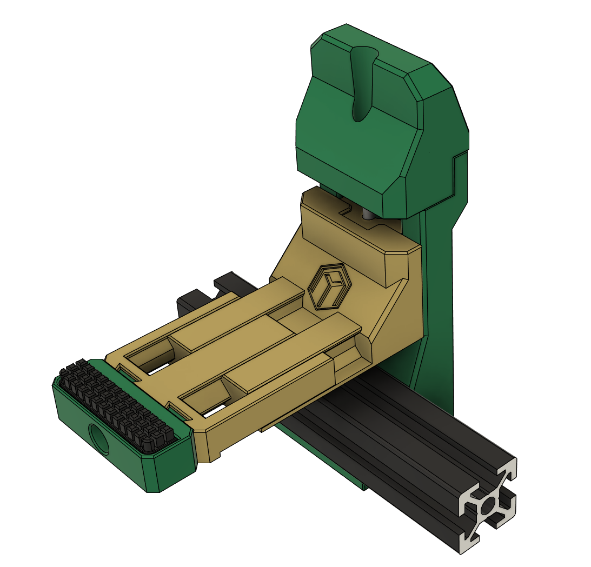

# BLV_Cube_AT_Brush

Modifies the Armored Turtle brush found [here](https://github.com/ArmoredTurtle/AFC-Accessories/tree/main/AT_Brush) to work with the BLV Cube. Designed for [FilamATrix](https://github.com/thunderkeys/FilamATrix) with a dragon hotend. Uses [this](https://www.printables.com/model/414702-stealthburner-and-clockwork2-for-blv-cubes) to mount the stealthburner.

The changed STL's are provided as well as STEP.

You will need to replace the two M5x10 BHCS with M5x16 BHSC.

If you need the longer arms the M3x35 SHCS will need to replaced with a M3x40 SHCS
